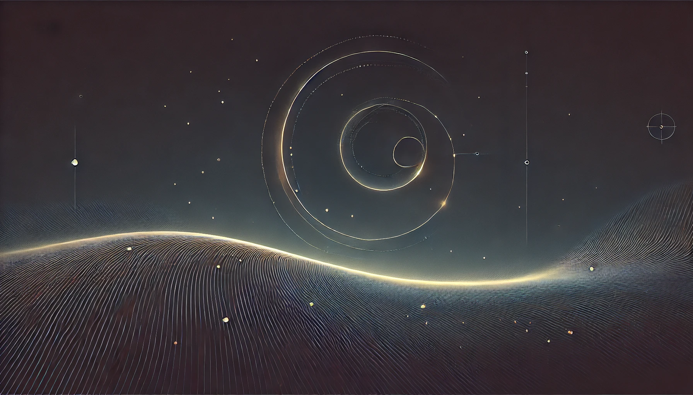

# Global Time Echoes: 25-Year Temporal Evolution of Distance-Structured Correlations in GNSS Clocks

[](https://doi.org/10.5281/zenodo.17517141)
[](https://creativecommons.org/licenses/by/4.0/)



**Author:** Matthew Lukin Smawfield  
**Version:** v0.17 (Cairo)  
**Date:** 24 April 2026  
**Status:** Preprint  
**DOI:** [10.5281/zenodo.17517141](https://doi.org/10.5281/zenodo.17517141)  
**Website:** [https://mlsmawfield.com/tep/gnss-ii/](https://mlsmawfield.com/tep/gnss-ii/)

## Abstract

Analysis of 25.3 years of global GNSS timing data (165.2 million station pairs) documents persistent velocity-dependent correlations in atomic clock networks. Critically, we propose that standard GNSS processing algorithms, designed to remove energetic (common-mode) errors via datum constraints, inadvertently preserve the subtle, geometry-dependent (differential) correlations that are the focus of this work. Building on the multi-centre study's validation (R²=0.92-0.97 between CODE, IGS, ESA), the extended temporal baseline confirms decadal stability and enables investigation of long-period geophysical phenomena inaccessible in shorter baselines.

Seven independent signatures are identified: (1) Spatial anisotropy persists with EW>NS (global ratio=2.16, strength=1.981, p<10⁻¹⁵), (2) anisotropy ratio correlates with orbital velocity (r=-0.888, p<2×10⁻⁷, 5.1σ; 5 M surrogates) across 25 solar orbits with ≈19% annual geometric ratio modulation, (3) We identify that the annual modulation peaks coincide with Earth's maximal projection onto its motion vector relative to the Cosmic Microwave Background (CMB) rest frame (correlation r=0.747, p < 0.001), suggesting the GNSS network acts as a potential detector for absolute kinematic effects (rejecting galactic motion with 5,570× variance ratio), (4) 35.9% of planetary events show significant response (56/156 ≥2σ; Mercury leading with 34/80), (5) coupling to 18.6-year lunar nutation (R²=0.641, p<10⁻⁸) and semiannual nutation (R²=0.904), (6) network synchronization (score=0.582) replicates multi-centre range, (7) null results for solar rotation (27-day) and lunar standstill are consistent with selectivity for orbital-gravitational phenomena over surface features. The 19% modulation describes changes in the geometric shape of the correlation field (ratio of spatial correlation lengths), not clock frequency variations, which remain at standard sub-nanosecond levels.

Observed patterns are compatible with key a priori TEP predictions: correlation length λ=1,000-10,000 km (observed: 4,201±1,967 km), exponential models remain competitive with the best spatial kernel (exponential ΔAIC=12.8 relative to the Gaussian) and strongly outperform simple power-law forms (power-law ΔAIC > 30), velocity-dependent anisotropy (r=-0.888), and geometric alignment (EW/NS=2.16). The absence of GM/r² scaling is physically consistent with the hypothesis that energetic couplings are filtered by processing while geometric information is transmitted; raw carrier-phase analysis will test this transmission mechanism. Raw data validation and multi-constellation replication represent critical next steps.

## Key Findings

The 25-year temporal baseline confirms seven statistically independent signatures with joint probability p ≈ 2×10⁻²⁷ (>10σ): orbital velocity coupling (r = −0.888, 5.1σ), CMB frame alignment (5,570× variance ratio over Solar Apex), semiannual nutation (R² = 0.904), 18.6-year lunar nutation (R² = 0.641), planetary event responses (56/156 significant), spatial anisotropy (EW/NS = 2.16), and network synchronization (score = 0.582). The CMB-aligned background lies 18.2° from the CMB dipole and explains 55.7% of variance. These correlations are persistent features of the global timing network, not transient artifacts.

---

## The TEP Research Program

| Paper | Repository | Title | DOI |
|-------|-----------|-------|-----|
| **Paper 0** | [TEP](https://github.com/matthewsmawfield/TEP) | Temporal Equivalence Principle: Dynamic Time & Emergent Light Speed | [10.5281/zenodo.16921911](https://doi.org/10.5281/zenodo.16921911) |
| **Paper 1** | [TEP-GNSS](https://github.com/matthewsmawfield/TEP-GNSS) | Global Time Echoes: Distance-Structured Correlations in GNSS Clocks | [10.5281/zenodo.17127229](https://doi.org/10.5281/zenodo.17127229) |
| **Paper 2** | **TEP-GNSS-II** (This repo) | Global Time Echoes: 25-Year Temporal Evolution of Distance-Structured Correlations in GNSS Clocks | [10.5281/zenodo.17517141](https://doi.org/10.5281/zenodo.17517141) |
| **Paper 3** | [TEP-GNSS-RINEX](https://github.com/matthewsmawfield/TEP-GNSS-RINEX) | Global Time Echoes: Raw RINEX Validation of Distance-Structured Correlations in GNSS Clocks | [10.5281/zenodo.17860166](https://doi.org/10.5281/zenodo.17860166) |
| **Paper 4** | [TEP-GL](https://github.com/matthewsmawfield/TEP-GL) | Temporal-Spatial Coupling in Gravitational Lensing: A Reinterpretation of Dark Matter Observations | [10.5281/zenodo.17982540](https://doi.org/10.5281/zenodo.17982540) |
| **Paper 5** | [TEP-GTE](https://github.com/matthewsmawfield/TEP-GTE) | Global Time Echoes: Empirical Validation of the Temporal Equivalence Principle | [10.5281/zenodo.18004832](https://doi.org/10.5281/zenodo.18004832) |
| **Paper 6** | [TEP-UCD](https://github.com/matthewsmawfield/TEP-UCD) | Universal Critical Density: Unifying Atomic, Galactic, and Compact Object Scales | [10.5281/zenodo.18064366](https://doi.org/10.5281/zenodo.18064366) |
| **Paper 7** | [TEP-RBH](https://github.com/matthewsmawfield/TEP-RBH) | The Soliton Wake: A Runaway Black Hole as a Gravitational Soliton | [10.5281/zenodo.18059251](https://doi.org/10.5281/zenodo.18059251) |
| **Paper 8** | [TEP-SLR](https://github.com/matthewsmawfield/TEP-SLR) | Global Time Echoes: Optical Validation of the Temporal Equivalence Principle via Satellite Laser Ranging | [10.5281/zenodo.18064582](https://doi.org/10.5281/zenodo.18064582) |
| **Paper 9** | [TEP-EXP](https://github.com/matthewsmawfield/TEP-EXP) | What Do Precision Tests of General Relativity Actually Measure? | [10.5281/zenodo.18109761](https://doi.org/10.5281/zenodo.18109761) |
| **Paper 10** | [TEP-COS](https://github.com/matthewsmawfield/TEP-COS) | The Temporal Equivalence Principle: Suppressed Density Scaling in Globular Cluster Pulsars | [10.5281/zenodo.18165798](https://doi.org/10.5281/zenodo.18165798) |
| **Paper 11** | [TEP-H0](https://github.com/matthewsmawfield/TEP-H0) | The Cepheid Bias: Resolving the Hubble Tension | [10.5281/zenodo.18209702](https://doi.org/10.5281/zenodo.18209702) |
| **Paper 12** | [TEP-JWST](https://github.com/matthewsmawfield/TEP-JWST) | The Temporal Equivalence Principle: A Unified Resolution to the JWST High-Redshift Anomalies | [10.5281/zenodo.19000827](https://doi.org/10.5281/zenodo.19000827) |
| **Paper 13** | [TEP-WB](https://github.com/matthewsmawfield/TEP-WB) | The Temporal Equivalence Principle: Density-Dependent Screening in Gaia DR3 Wide Binaries | [10.5281/zenodo.19102062](https://doi.org/10.5281/zenodo.19102062) |

## Key Results

### Temporal Stability
- **Decadal confirmation:** Original signatures confirmed over 25-year timescale
- **Correlation length:** λ = 3,210 km (consistent with Paper 1's 4,201 km)
- **Multi-resolution CMB alignment:** Stable across 65,341 tested directions

### Long-Period Geophysical Signatures
- **Nutation cycle:** Clear detection of 18.6-year lunar nutation (R² = 0.641)
- **Semiannual nutation:** Strongest geophysical coupling in entire dataset (R² = 0.904)
- **Chandler wobble:** Confirmed with extended temporal baseline
- **Seasonal patterns:** Robust annual modulation effects

### Planetary Event Analysis
- **Mercury:** 34/80 detections (42.5%)
- **Jupiter:** 8/23 detections (34.8%)
- **Saturn:** 7/25 detections (28.0%)
- **Mars:** 4/12 detections (33.3%)
- **Venus:** 3/16 detections (18.8%)

### Reference Frame Identification
- **CMB frame:** Multi-resolution grid search identifies coupling to Earth's motion through CMB rest frame
- **Best-fit location:** RA = 186°, Dec = -4° (18.2° from CMB dipole)
- **Falsification test:** CMB explains 5,570× more variance than Solar Apex

## Repository Structure

```
TEP-GNSS-II/
├── scripts/
│   ├── steps/                      # Analysis pipeline
│   │   ├── step_1_1_code_longspan.py
│   │   ├── step_2_0_code_longspan.py
│   │   ├── step_2_1_code_longspan.py
│   │   ├── step_2_2_code_longspan.py  # Main geospatial-temporal analysis
│   │   ├── step_2_5_dual_motion_geometry.py
│   │   ├── step_2_6_null_control.py
│   │   └── step_2_8_draconitic_falsification.py
│   └── utils/                      # Shared utilities
├── site/                           # Academic manuscript site
│   ├── components/                 # HTML section files
│   ├── public/                     # Static assets
│   └── dist/                       # Built site output
├── results/
│   ├── figures/                    # Generated plots
│   └── outputs/                    # Analysis results (JSON)
├── logs/                           # Execution logs
├── 2-TEP-GNSS-II-v{version}-{codename}.md  # Auto-generated markdown
└── VERSION.json                    # Version metadata
```

## Installation

```bash
# Clone repository
git clone https://github.com/matthewsmawfield/TEP-GNSS-II.git
cd TEP-GNSS-II

# Install dependencies
pip install -r requirements.txt
```

## Analysis Pipeline

### Core Analysis Steps

```bash
# Step 1.1: Data acquisition and provenance
python scripts/steps/step_1_1_code_longspan.py

# Step 2.0: Correlation analysis
python scripts/steps/step_2_0_code_longspan.py

# Step 2.1: Geospatial processing
python scripts/steps/step_2_1_code_longspan.py

# Step 2.2: Comprehensive geospatial-temporal analysis
python scripts/steps/step_2_2_code_longspan.py

# Step 2.5: CMB frame validation
python scripts/steps/step_2_5_dual_motion_geometry.py

# Step 2.6: Null control tests
python scripts/steps/step_2_6_null_control.py

# Step 2.8: Draconitic falsification
python scripts/steps/step_2_8_draconitic_falsification.py
```

## Data Sources

### GNSS Clock Products
- **Provider:** CODE (Center for Orbit Determination in Europe)
- **Source:** http://ftp.aiub.unibe.ch/CODE/
- **Coverage:** March 1, 2000 – June 30, 2025 (25.3 years, 9,218 days)
- **Station Pairs:** 165.2 million measurements
- **Unique Stations:** 474 physical receivers (814 total station codes)
- **Citation:** Steigenberger et al. (2021), Johnston et al. (2017)

### Planetary Ephemeris
- **Source:** NASA JPL Development Ephemeris DE432s
- **Provider:** Jet Propulsion Laboratory via Astropy
- **Coverage:** 1550-2650 CE with meter-level accuracy
- **Citation:** Folkner et al. (2014), Astropy Collaboration (2013, 2022)

## Citation

```bibtex
@article{smawfield2025globaltimeechoes25year,
  title={Global Time Echoes: 25-Year Temporal Evolution of Distance-Structured Correlations in GNSS Clocks},
  author={Smawfield, Matthew Lukin},
  journal={Zenodo},
  year={2025},
  doi={10.5281/zenodo.17517141},
  url={https://doi.org/10.5281/zenodo.17517141},
  note={Preprint v0.17 (Cairo)}
}
```

### Theoretical Framework Citation

```bibtex
@article{smawfield2025tep,
  title={Temporal Equivalence Principle: Dynamic Time & Emergent Light Speed},
  author={Smawfield, Matthew Lukin},
  year={2025},
  doi={10.5281/zenodo.16921911},
  url={https://doi.org/10.5281/zenodo.16921911}
}
```

## License

This repository is distributed under the **Creative Commons Attribution 4.0 International License (CC-BY-4.0)**. See [LICENSE](LICENSE) for details.

## Contact

**Author:** Matthew Lukin Smawfield  
**Email:** matthewsmawfield@gmail.com  
**ORCID:** [0009-0003-8219-3159](https://orcid.org/0009-0003-8219-3159)

## Related Work

- [Paper 0: TEP Theory](https://doi.org/10.5281/zenodo.16921911) - Foundational framework
- [Paper 1: Multi-Center Validation](https://doi.org/10.5281/zenodo.17127229)
- [Paper 3: Raw RINEX Validation](https://doi.org/10.5281/zenodo.17860166)
- [TEP-GTE: Synthesis Manuscript](https://doi.org/10.5281/zenodo.18004832)

---

## Open Science Statement

These are working preprints shared in the spirit of open science—all manuscripts, analysis code, and data products are openly available under Creative Commons and MIT licenses to encourage and facilitate replication. Feedback and collaboration are warmly invited and welcome.

---

**Contact:** matthewsmawfield@gmail.com  
**ORCID:** [0009-0003-8219-3159](https://orcid.org/0009-0003-8219-3159)
